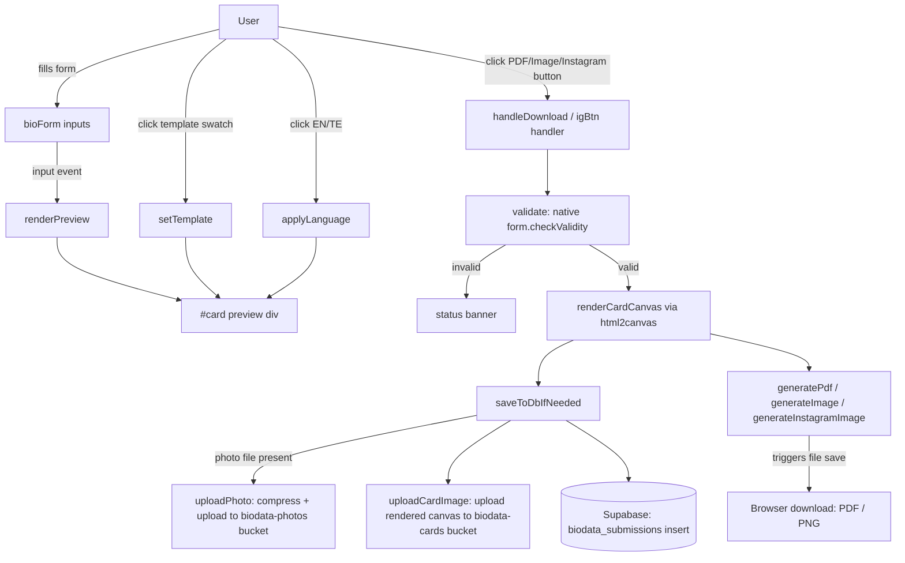

# Architecture

## Overview

This is a client-only static web app: a single `index.html` file containing all markup, CSS, and JavaScript, with no build step, bundler, or framework. It uses three third-party libraries loaded from CDN — `html2canvas` and `jsPDF` for turning the on-page biodata card into a downloadable image/PDF, and `@supabase/supabase-js` for optional persistence. The only server-side component is a Supabase project (Postgres + Storage), defined by `supabase_setup.sql`, which the page talks to directly from the browser using a public anon key restricted by row-level security to insert-only access.

## How it fits together

A single concrete flow, PDF download, traced through the real code:

1. The user fills the form; every `input` event on `#bioForm` re-runs `renderPreview()`, which reads each field, looks up its translated label/value via `label()`/`displayValue()`, and rewrites `#previewBody`'s HTML — this is what keeps the on-page card in sync as you type.
2. Clicking **Download as PDF** calls the `pdfBtn` click handler, which calls `handleDownload(btn, "pdf", generatePdf)`.
3. `handleDownload` first calls `validate()` (native HTML5 `checkValidity()` on required fields); if invalid it shows an error status and stops.
4. It renders the current `#card` DOM node to a canvas once via `renderCardCanvas()` (`html2canvas(card, {scale:2, ...})`), so the same canvas can be reused for both the database save and the actual download.
5. If a Supabase client was configured, `saveToDbIfNeeded(cardCanvas)` builds a plain object from `FIELDS`, optionally uploads the chosen photo (after client-side compression via `compressImage()`) and the rendered card canvas to Supabase Storage, and inserts one row into `public.biodata_submissions` — guarded by a `savedToDb` flag so a submission is only ever saved once per page load, even if the user downloads PDF, image, and Instagram version in sequence.
6. `generatePdf(canvas)` runs regardless of whether the save succeeded: it computes a scale that fits the canvas onto a single A4 page in `jsPDF`, centers it, and calls `pdf.save(...)`, which triggers the browser's file download.
7. Status text (`#status`) is updated at each stage (saved / save failed / db not configured / generation error) via `showStatus()`.

The Image and Instagram-post downloads follow the same `handleDownload` path with a different generator function (`generateImage`, or the separate `igBtn` handler calling `generateInstagramImage`, which re-renders the off-screen `#igCard` element with `renderIgCard()` before capturing it).

## Directories / files

There are no real subdirectories beyond `.git` and `.claude` (Claude Code's own project config, not part of the app). Everything the app needs is at the repo root.

| Path | Purpose |
|---|---|
| `index.html` | The entire application — see file reference below for its internal structure |
| `supabase_setup.sql` | Defines the `biodata_submissions` table, RLS policies, and the two storage buckets used by `index.html`; also contains an idempotent migration block for evolving an already-deployed schema |
| `logo.svg` | Two-ring monogram used as the favicon and header logo |
| `CNAME` | GitHub Pages custom domain (`matrimony-biodata-maker.com`) |
| `.claude/launch.json` | Dev-server config used by Claude Code's preview tooling (`python -m http.server 8123`) — not read by the app itself |

## File reference — inside `index.html`

Since the whole app is one file, this table breaks it down by logical section (in source order) rather than by file.

| Section | Lines (approx.) | Purpose |
|---|---|---|
| `<head>` CDN script tags | 8–10 | Loads `html2canvas`, `jsPDF`, and `@supabase/supabase-js` from `cdn.jsdelivr.net` |
| `<style>` — base + form | 11–243 | Layout (`.layout` two-column grid), form field styling, buttons, status banner |
| `<style>` — template picker & card variables | 244–421 | The 4 templates (`tpl-classic`/`tpl-modern`/`tpl-elegant`/`tpl-royal`) are implemented as CSS custom-property overrides on `#card`/`#igCard` (`--c-bg`, `--c-heading`, `--c-accent`, etc.), not separate markup |
| `<style>` — `#igCard` | 433–496 | Fixed 1080×1350px off-screen (`left:-9999px`) card used only as an `html2canvas` capture source for the Instagram export; reuses the same CSS variables as the main card so template/color choices stay in sync |
| `<body>` — header + language picker | 501–508 | App title/subtitle (i18n-driven via `data-i18n` attributes) and the EN/Telugu toggle buttons |
| `<body>` — `#bioForm` | 513–892 | The five field groups (Personal, Astro, Education & Career, Family, Contact) plus photo upload and the PDF/Image/Instagram action buttons |
| `<body>` — template picker + `#card` preview | 895–921 | The 4 template swatches and the live preview card (`#photoBox`, `#nameLine`, `#previewBody`) |
| `<body>` — `#igCard` markup | 927–935 | The off-screen Instagram card's DOM, populated by `renderIgCard()` on demand |
| `SUPABASE_URL` / `SUPABASE_ANON_KEY` + client init | 942–948 | Hardcoded project config; `supabaseClient` stays `null` if the URL/key look unset, which disables all persistence but not the downloads |
| `FIELDS` | 950–958 | The canonical list of form field IDs that map 1:1 to `biodata_submissions` columns — used when building the record to insert |
| `I18N` (`en`/`te`) | 968–1161 | All UI strings, field labels, placeholders, dropdown option labels, and JS-generated status messages for both languages, keyed identically per language |
| `t()`, `label()`, `displayValue()` | 1166–1182 | i18n lookup helpers. `displayValue()` is the important one: select fields store a canonical English value in the DOM, and this maps it to the current language's display text only for rendering — so a record saved while viewing Telugu still has English enum values |
| `applyOptionTranslations()`, `applyStaticTranslations()`, `applyLanguage()` | 1184–1231 | Re-render all translatable UI (labels, placeholders, `<option>` text, preview) when the language changes; persists the choice to `localStorage` |
| `setTemplate()` | 1235–1253 | Swaps the `tpl-*` class on both `#card` and `#igCard`, updates the subtitle text, and persists the choice to `localStorage` |
| Photo upload handling | 1262–1284 | Validates file type (JPG/PNG only), reads it as a data URL for the live preview (`photoDataUrl`) |
| `wirePhoneField()` | 1289–1301 | Combines a country-code `<select>` and a number `<input>` into one hidden field (`phone`/`father_phone`/`mother_phone`), used by the record and both card renderers |
| `renderPreview()` | 1303–1345 | Rebuilds `#previewBody`'s HTML from current form values, grouped into the same five sections as the form, respecting the per-phone "show in biodata" checkboxes |
| `compressImage()` | 1364–1380 | Client-side resize (max 800px) + re-encode to JPEG (quality 0.8) before any photo is uploaded, to limit Supabase storage usage |
| `uploadPhoto()`, `uploadCardImage()` | 1382–1402 | Upload the compressed photo / rendered card canvas to the `biodata-photos` / `biodata-cards` Supabase Storage buckets and return their public URLs |
| `renderCardCanvas()`, `generatePdf()`, `generateImage()` | 1410–1443 | `html2canvas`-based capture of `#card`, then either fit-to-A4-page PDF export (`jsPDF`) or direct PNG download |
| `saveToDbIfNeeded()` | 1447–1471 | Builds the record from `FIELDS`, uploads photo/card image if applicable, inserts into `biodata_submissions`; no-ops if already saved this session or no Supabase client is configured |
| `validate()`, `handleDownload()` | 1473–1520 | Shared flow for all three download buttons: validate → render canvas once → save-if-needed → run the specific generator → update status text |
| `calcAge()`, `val()`, `renderIgCard()`, `generateInstagramImage()` | 1532–1601 | Instagram-specific: computes age from DOB, builds the tagline/detail lines (education, occupation, income, location, religion/caste), and captures `#igCard` at a fixed 1080×1350 size |
| Button wiring + `applyLanguage(currentLang)` | 1522–1621 | Attaches all click handlers and performs the initial render on page load |

## Key design decisions / gotchas

- **No build step by design.** Everything lives in one HTML file with inline `<style>`/`<script>`; there's no `package.json` or bundler to keep in sync. Any change to behavior means editing `index.html` directly.
- **Templates are CSS variables, not separate markup.** All four visual templates share the exact same `#card`/`#igCard` DOM; switching templates only toggles a `tpl-*` class that overrides custom properties (`--c-bg`, `--c-heading`, `--c-accent`, etc.). Adding a new template means adding a `#card.tpl-<name>` CSS block plus registering it in `I18N.*.subtitles` (see `setTemplate()`'s validity check) — not new HTML.
- **`#igCard` is real DOM, not a canvas re-draw.** It's positioned off-screen (`left:-9999px`) at a fixed 1080×1350px so `html2canvas` can capture it as a proper Instagram-post image on demand, without ever being visible to the user.
- **Language choice never changes stored data shape.** Dropdown fields keep a canonical English `value` in the DOM regardless of UI language; `displayValue()` maps to the current language purely for display. This is what keeps Supabase records (and the biodata card's data-driven rendering) consistent no matter which language a user filled the form in.
- **The Supabase anon key is meant to be public.** It's restricted entirely by the row-level security policies in `supabase_setup.sql` (insert-only, no `SELECT`/`UPDATE`/`DELETE` for the `anon` role) — this is the standard Supabase pattern for a public-facing form, not a leaked secret. Viewing submitted data requires logging into the Supabase dashboard directly.
- **Storage buckets intentionally have no `SELECT` policy.** The buckets are public, so a known file's direct public URL is already fetchable without RLS; adding a broad `SELECT` policy would instead let anyone *list* every file in the bucket via the Storage API (a warning Supabase's dashboard flags explicitly) — the SQL comments call this out.
- **`saveToDbIfNeeded` runs at most once per page load** (`savedToDb` flag), so downloading PDF, then Image, then Instagram for the same filled-in form doesn't create duplicate submissions.
